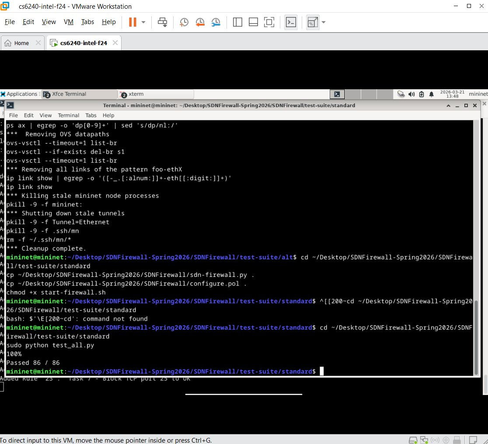
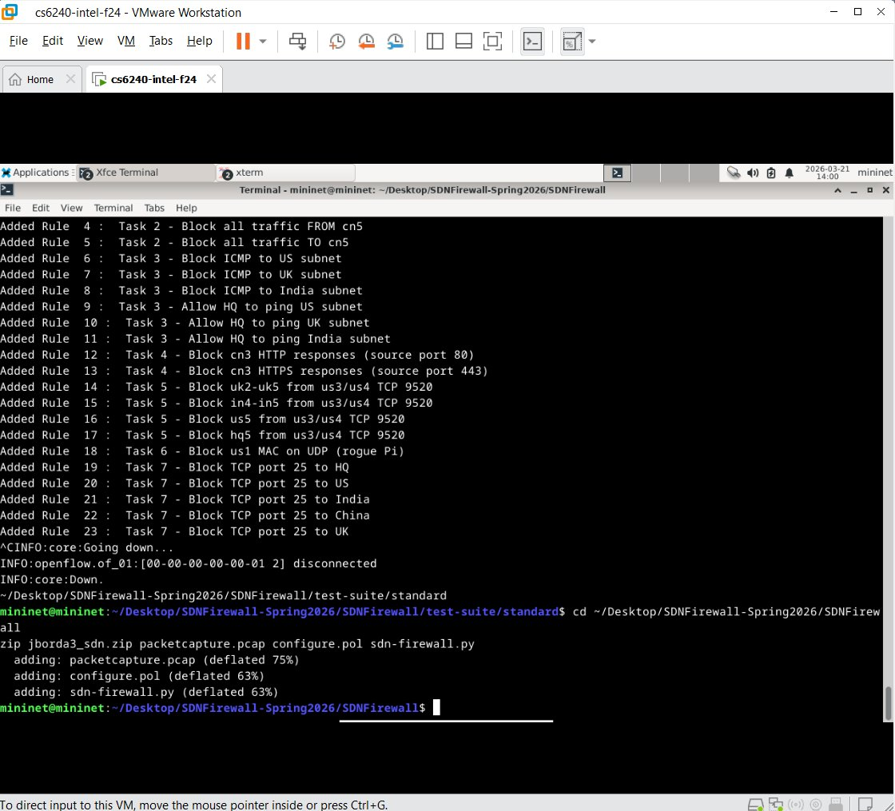
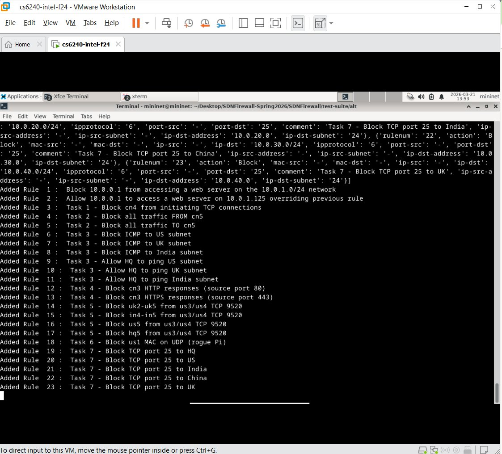
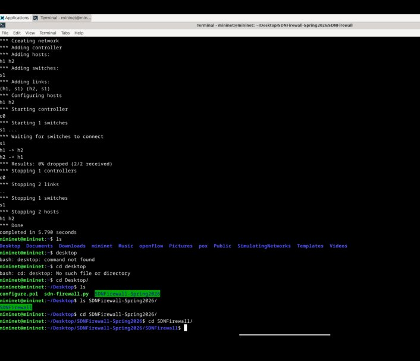
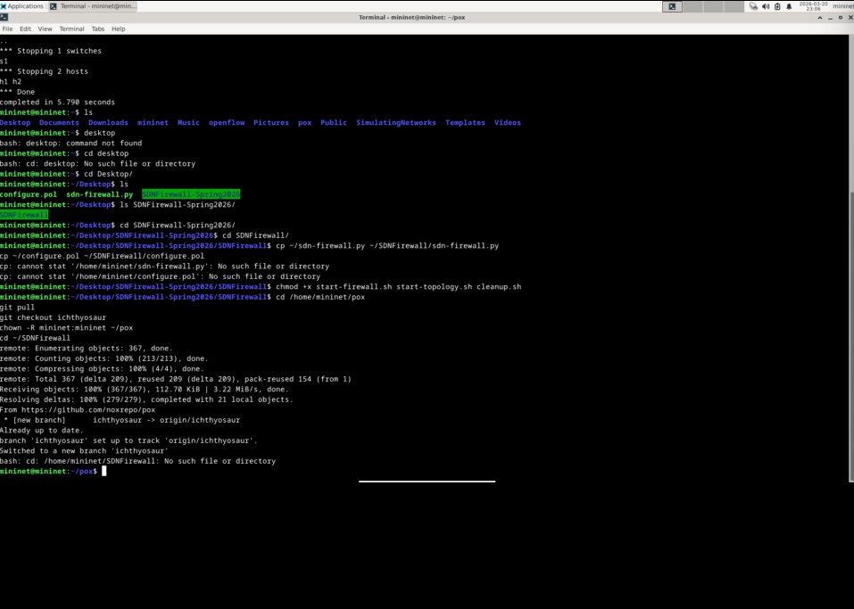
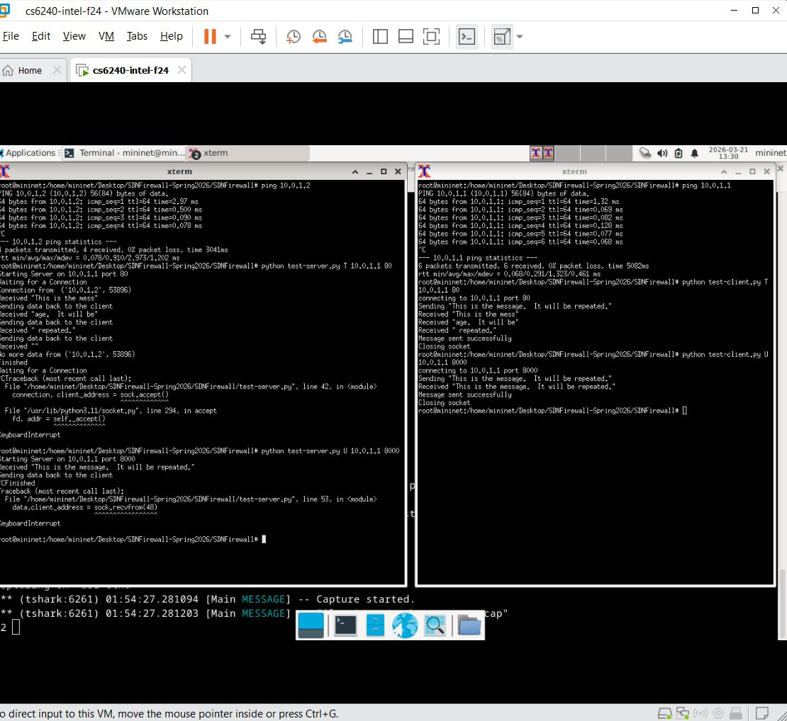
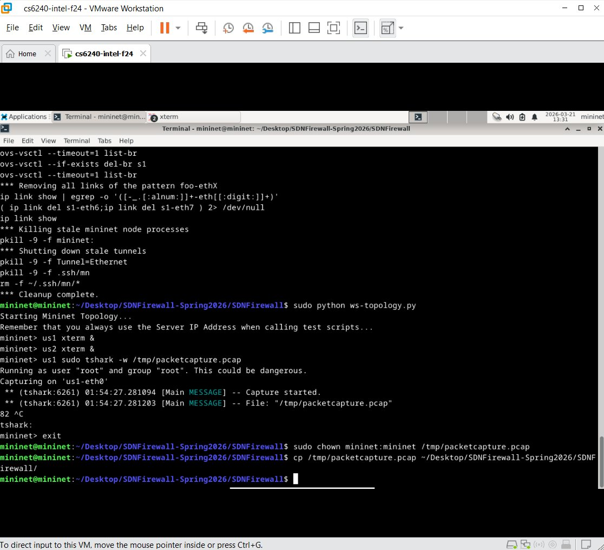

# SDN Firewall with POX

## What This Project Is

This was a project for CS 6250 (Computer Networks) at Georgia Tech where I built a firewall for a simulated corporate network using Software Defined Networking. The idea is that instead of configuring each switch individually, you have one central controller (POX) that tells all the switches what to do with traffic — what to let through and what to drop.

The network simulates a company with 5 offices (Headquarters, US, India, China, UK) all connected through one switch, plus some external "world" hosts representing the internet.

| Network | Hosts | Subnet |
|---------|-------|--------|
| Headquarters | hq1–hq5 | 10.0.0.0/24 |
| US Office | us1–us5 | 10.0.1.0/24 |
| India Office | in1–in5 | 10.0.20.0/24 |
| China Office | cn1–cn5 | 10.0.30.0/24 |
| UK Office | uk1–uk5 | 10.0.40.0/24 |
| External | other1–other2 | 10.0.200.0/24 |

## What I Built

There were two main parts to code, plus a Wireshark packet capture.

### The Firewall Engine (sdn-firewall.py)

This is the Python code that reads a config file full of firewall rules and turns each one into an OpenFlow flow modification object that POX can understand. It needs to handle matching on MAC addresses, IP addresses (with CIDR notation), protocols like ICMP/TCP/UDP, and port numbers.

The tricky part was getting the priorities right — Allow rules need to override Block rules when they overlap, so I set Allow at priority 5000 and Block at 1000. I also had to make sure the OpenFlow prerequisites were set correctly (you can't match on a TCP port without first declaring you're matching IPv4 and TCP, or POX just silently ignores your rule).

### The Firewall Rules (configure.pol)

I wrote 23 rules covering 7 different security scenarios:

- **Quarantine a host with a TCP worm** — block all outbound TCP from the infected machine
- **Fully isolate a compromised host** — block everything in both directions
- **ICMP ping access control** — block pings to certain subnets from the outside world, but allow HQ to still ping those subnets (this one was the trickiest because you need Allow overrides for HQ)
- **Block web server responses** — block a server from responding on ports 80/443 by filtering on source port, which also kills incoming connections since the server can never complete the TCP handshake
- **Restrict access to a microservice** — use CIDR notation (/28, /30) to target specific groups of hosts with minimal rules
- **Block a rogue device by MAC address** — catch a cloned device at Layer 2 regardless of what IP it's using
- **Block external SMTP access** — prevent the outside world from reaching port 25 on any corporate subnet

### Packet Capture (packetcapture.pcap)

Used tshark to capture live traffic between two hosts on the simulated network — ICMP pings, a TCP connection on port 80, and a UDP connection on port 8000. Then opened it in Wireshark to look at the actual packet headers, which helped me understand exactly what fields the firewall rules need to match against.

## Test Results

Both test suites passed with full marks:

**Alternate test suite** — tests the engine against a known-good config (45/45):

**Standard test suite** — tests my engine + my rules together (86/86):

**POX controller loading all 23 rules:**

## Other Screenshots

### VM setup — Mininet working

### POX controller update

### Wireshark capture in progress

### Capture complete — 82 packets

## Tools Used

- Mininet (network simulator)
- POX (OpenFlow SDN controller, Python)
- OpenFlow 1.0
- Wireshark / tshark
- Python 3
- VMware Workstation with Debian Bullseye VM

## Note

The actual source code and config file aren't included here since GT's honor code doesn't allow sharing project solutions publicly. This repo is just to document what I did and show the results.
